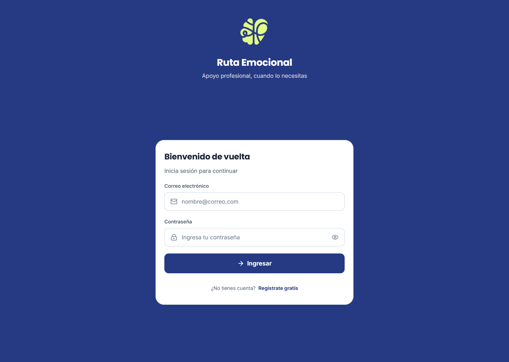
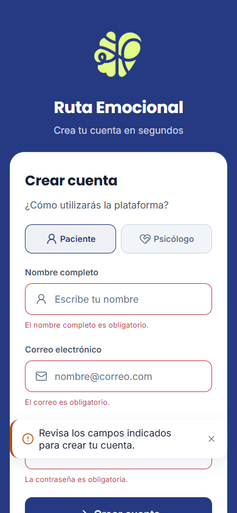
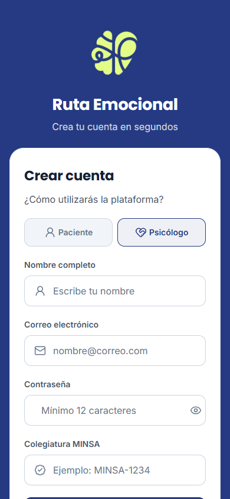

# Evidencia final del refactor visual

**Proyecto:** Ruta Emocional<br>
**Categoría y área:** Aficionado / Desarrollo<br>
**Corte técnico:** RV-7C a RV-8D<br>
**Fecha de verificación:** 3 de septiembre de 2026<br>
**Rama verificada:** `postgresql-migration`

## 1. Objetivo y alcance

Este documento consolida la evidencia del refactor visual y de su validación técnica. El alcance incluye pacientes e historia clínica, acceso y verificación profesional, mensajería y MENTA, estados comunes, responsive, accesibilidad, recursos de marca, bundle Android y recorrido web público.

No sustituye el video de navegación. Tampoco declara como aprobada una prueba física que no haya sido ejecutada: al momento de este corte ADB estaba disponible, pero no había un dispositivo Android conectado.

## 2. Trazabilidad con la rúbrica oficial

| Requisito Aficionado / Desarrollo | Evidencia verificable | Estado |
|---|---|---|
| README técnico | [`README.md`](../../../README.md) | Completo |
| Diagrama de base de datos | [DER conceptual](../../../output/pdf/modelo-entidad-relacion-conceptual-ruta-emocional.pdf), [catálogo conceptual](modelo-entidad-relacion-conceptual.md) y [3FN](../../database/normalization-3nf.md) | Completo; supera 2FN |
| Interfaces navegables y formularios funcionales | [Inventario funcional](evidencia-interfaz-y-formularios.md), [informe rector](informe-rector-refactor-visual.md) y capturas de este documento | Completo para el recorrido validado |
| Control de versiones | [Evidencia Git](evidencia-control-versiones.md) | Completo al confirmar y sincronizar este corte |
| Seguridad, código legible y tres roles | [Roles y permisos](roles-y-permisos.md), [matriz de autorización](../../security/authorization-matrix.md) y pruebas backend | Completo |
| Ejecución local | [`README.md`](../../../README.md#instalación) y comprobaciones de este documento | Completo |
| Video | A cargo del responsable del proyecto | Fuera del corte técnico |

## 3. Evidencia visual

### 3.1 Login web en escritorio



La pantalla presenta una única tarea, jerarquía clara, Poppins/Inter, acción dominante, campos etiquetados, iconografía lineal y ancho de lectura controlado. El render se capturó desde el bundle web exportado en una ventana de escritorio.

### 3.2 Registro compacto y validación



La validación bloquea el envío incompleto, asocia un mensaje a cada campo, conserva un resumen no intrusivo y no depende únicamente del color. En 390 px no se detectó desbordamiento horizontal y todos los controles visibles alcanzaron al menos 44 px de alto.

### 3.3 Registro profesional



La variante profesional reutiliza el mismo formulario y revela la colegiatura solo cuando corresponde. Paciente y psicólogo se exponen como radios reales; la opción activa se anuncia con `aria-checked` en web y `accessibilityState.checked` en nativo.

### Integridad de las capturas

| Archivo | Resolución | SHA-256 |
|---|---:|---|
| `01-login-web-escritorio.png` | 1440 × 1024 | `818D740AF3F7BC81C91DE6112C3AB3EE972639FAD492A22B24DEF6C9FDEE7993` |
| `02-registro-validacion-web-movil.png` | 390 × 844 | `C5C8BE3370785104D30283077C6855F7D4074DF493221B42E128B0E655DC20E0` |
| `03-registro-profesional-web.png` | 390 × 844 | `F3120FB84F16C1A973D534D0A08ED077DD9FBE538BBE041A785C342391FDA977` |

## 4. Validación visual y accesible ejecutada

| Control | Resultado |
|---|---|
| Render del bundle web exportado | Aprobado |
| Consola del navegador en login y registro | Sin errores ni advertencias |
| Vista compacta a 390 × 844 | Sin desbordamiento horizontal |
| Vista de escritorio | Sin desbordamiento horizontal |
| Altura mínima de controles visibles | 44 px |
| Validación de formulario | Alertas por campo y resumen visibles |
| Navegación por teclado | Orden coherente por campos, acción y retorno |
| Radios paciente/psicólogo | `aria-checked=true/false` verificado en DOM |
| Pantallas inactivas del stack | Aisladas con `aria-hidden=true` |
| Idioma del documento web | `es` |
| Color de tema web | `#253A82` |
| Viewport móvil | Declarado correctamente |
| Contraste de combinaciones funcionales | WCAG AA automatizado |
| Movimiento reducido | Respetado por hooks y componentes comunes |

Durante la aceptación web se detectó que React Native Web no trasladaba el estado seleccionado de los radios desde `accessibilityState`. La corrección conserva la semántica nativa y añade ARIA explícito para web. El validador visual impide reincorporar radios, checkboxes o tabs sin su estado ARIA correspondiente.

## 5. Verificación técnica reproducible

| Verificación | Resultado del corte |
|---|---|
| TypeScript frontend | Aprobado, cero errores |
| Validador del sistema visual | Aprobado |
| Validador de configuración nativa | Aprobado |
| Compatibilidad Expo SDK 57 | Dependencias actualizadas y compatibles |
| Pruebas frontend | 30 suites, 89 pruebas aprobadas |
| Pruebas unitarias backend | 46 pruebas aprobadas |
| Salud del backend | `live=ok` y `ready=ok` |
| PostgreSQL en readiness | `database=ok` |
| Outbox en readiness | `messagingOutbox=ok` después de recuperación automática |
| Privacidad en readiness | `privacyRequests=ok` |
| Exportación web | Aprobada, 4 928 módulos |
| Exportación Android/Hermes | Aprobada, 3 538 módulos |

Comandos equivalentes:

```bash
npm --prefix frontend run typecheck
npm --prefix frontend test -- --runInBand
npm --prefix frontend run validate:design
npm --prefix frontend run validate:native-config
npm --prefix backend test
npx --prefix frontend expo export --platform web
npx --prefix frontend expo export --platform android
```

Los bundles se generaron fuera del repositorio para evitar versionar compilados. Los secretos, archivos `.env`, tokens, evidencias profesionales y datos clínicos no forman parte de las capturas ni de este documento.

En una jornada de QA prolongada el dispatcher registró tres ciclos fallidos transitorios y continuó reintentando. La comprobación posterior devolvió `messagingOutbox=ok`, sin retraso ni dead letters. No se adjudica una causa definitiva sin logs externos persistidos; este dato queda conservado para la futura fase de observabilidad productiva.

## 6. Resultado por fase

| Fase | Resultado |
|---|---|
| RV-7C Pacientes e historia clínica | Implementada y automatizada; aceptación clínica física pendiente |
| RV-7D Login, registro, perfil y verificación | Implementada y automatizada; recorrido público web aprobado |
| RV-7E Inbox, conversación y MENTA | Implementada y automatizada; prueba multidispositivo pendiente |
| RV-8A Estados, responsive y accesibilidad | Implementada; regresión ARIA encontrada y corregida |
| RV-8B Iconos, splash y marca | Isotipo oficial integrado en interfaz, icono general, Android, splash y web |
| RV-8C Android y web | Bundles aprobados y web inspeccionada; Android físico pendiente |
| RV-8D Evidencia final | Paquete técnico y capturas públicas completos; video fuera de alcance |

## 7. Gates manuales que no deben presentarse como aprobados

1. Conectar un Android real y ejecutar el recorrido completo con paciente y psicólogo ficticios.
2. Validar TalkBack, fuente máxima, reducir movimiento, teclado abierto, rotación, selección de evidencia y reconexión.
3. Repetir conversación con dos dispositivos y comprobar envío simultáneo, reconexión y ausencia de duplicados.
4. Recorrer historia clínica con una relación asistencial ficticia, incluyendo firma y enmienda.
5. Capturar las pantallas autenticadas finales únicamente con cuentas y datos ficticios.

Estos gates no invalidan el cumplimiento Aficionado / Desarrollo ya documentado, pero sí son necesarios antes de afirmar una aceptación móvil integral o preparación productiva.

## 8. Cierre de identidad visual del producto

- El logotipo y el isotipo entregados se contrastaron con las páginas 7 a 20 del diseño maestro de Canva.
- La aplicación reconoce el logotipo horizontal como firma principal y reserva el isotipo como identificador complementario para espacios compactos y activos de plataforma.
- Las aplicaciones positiva y negativa conservan zona segura, proporción mediante `contain` y protección ante inversión automática de color.
- Login, registro y splash usan el logotipo negativo; rehidratación e inicio usan el positivo; los encabezados titulados consumen el isotipo mediante un componente separado.
- Icono general, primer plano adaptativo y favicon mantienen el isotipo sobre `#253A82`, mientras el splash emplea la firma horizontal negativa.
- No se declara icono monocromático temático porque la guía de identidad prohíbe explícitamente las variaciones en escala de grises.
- Las pruebas de identidad validan ambas aplicaciones, accesibilidad y ausencia de deformación; el validador nativo fija rutas, tamaños y colores de plataforma.
